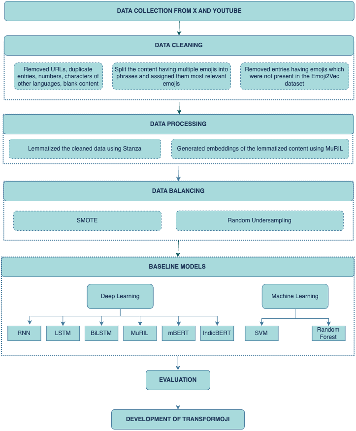
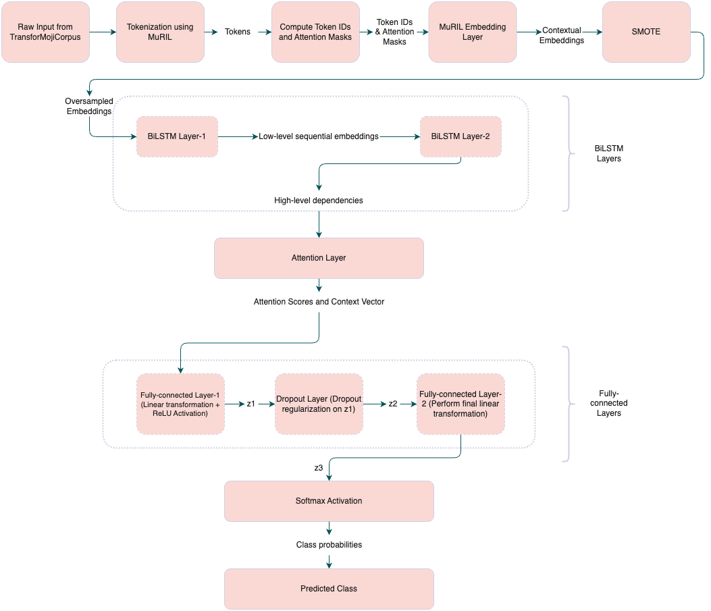

# TransforMoji: A Novel Emoji Prediction Model for Hindi Texts with a Custom Transformer-Based Model and Dataset

## Overview
TransforMoji is a novel transformer-based model designed specifically for emoji prediction in Hindi texts. The model achieves state-of-the-art performance with a cosine similarity score of 0.968, setting a new benchmark for semantic understanding in Hindi emoji prediction.
Our custom-curated dataset, TransforMojiCorpus, contains 69,269 Hindi texts spanning 256 emoji classes, making it one of the largest Hindi-emoji datasets available. The dataset combines real-world data from social media platforms with synthetic data to ensure comprehensive coverage.

📄 Read our complete research paper [here](URL).

## Repository Structure
```
.
├── baseline_model_training_and_evaluation  # Baseline models and performance evaluation
├── transformoji_training_and_evaluation   # Transformer-based model training & evaluation
├── dataset                                # Processed datasets used for training
├── plots                                  # Visualization of model performance
├── LICENSE                                # Licensing information
├── README.md                              # Project documentation
├── apply_lemmatization.py                 # Script to apply lemmatization 
├── apply_smote.py                         # Script to apply SMOTE for balancing classes
├── create_embeddings.py                   # Script to generate embeddings
```

## Features
🎯 State-of-the-art performance in Hindi emoji prediction

📚 Large-scale dataset with 69,269 entries

🔄 Support for 256 emoji classes

🤖 Novel two-layered Bi-LSTM architecture with attention mechanism

📊 Comprehensive evaluation metrics (Cosine Similarity, Accuracy, F1 Score)

## Process Flow


## Methodology

### 1. Data Collection and Preparation
- Gathered Hindi text-emoji pairs from social media platforms (X and YouTube)
- Generated additional synthetic data to enhance dataset coverage
- Created TransforMojiCorpus with 69,269 entries across 256 emoji classes

### 2. Data Preprocessing
- Cleaned and standardized text data by removing special characters, URLs, and duplicate entries
- Converted emojis to their standardized format
- Applied lemmatization using Stanza for Hindi text processing
- Generated text embeddings using MuRIL (Multilingual Representations for Indian Languages)

### 3. Data Balancing
- Analyzed class distribution revealing significant imbalance
- Applied two sampling techniques:
  - SMOTE (Synthetic Minority Over-sampling Technique)
  - Random Undersampling
- Evaluated model performance with both balanced datasets

### 4. Baseline Models
- Implemented baseline models:
  - Traditional ML: SVM, Random Forest
  - Deep Learning: RNN, LSTM, BiLSTM
  - Transformer-based: MuRIL, mBERT, IndicBERT
 
### 5. Evaluation
Evaluated baseline models using three key metrics:
- Cosine Similarity with emoji embeddings
- Classification Accuracy
- F1 Score
 
    | Model     | Balancing Technique | Epochs | Cosine Similarity | Accuracy | F1 Score |
    |-----------|---------------------|--------|-------------------|----------|----------|
    | **LSTM**  | SMOTE               | 10     | 0.8654            | 0.8047   | 0.79907  |
    |           |                     | 50     | 0.9287            | 0.8944   | 0.8899   |
    |           |                     | 100    | 0.9410            | 0.9196   | 0.9167   |
    |           | Undersampling        | 10     | 0.6265            | 0.4697   | 0.4468   |
    |           |                     | 50     | 0.7440            | 0.6314   | 0.6183   |
    | **BiLSTM**| SMOTE               | 10     | 0.8093            | 0.7195   | 0.7249   |
    |           |                     | 50     | 0.8768            | 0.8209   | 0.8210   |
    |           |                     | 100    | 0.9073            | 0.8664   | 0.8637   |
    |           | Undersampling        | 10     | 0.6858            | 0.5460   | 0.5315   |
    |           |                     | 50     | 0.7014            | 0.5698   | 0.5662   |
    | **MuRIL** | SMOTE               | 10     | 0.7952            | 0.7034   | 0.6968   |
    |           |                     | 50     | 0.8716            | 0.7862   | 0.7821   |
    |           |                     | 100    | 0.8775            | 0.8205   | 0.8166   |
    |           | Undersampling        | 10     | 0.5656            | 0.3954   | 0.3614   |
    |           |                     | 50     | 0.6434            | 0.4968   | 0.4634   |
    | **RNN**   | SMOTE               | 10     | 0.8650            | 0.8040   | 0.8000   |
    |           |                     | 50     | 0.9207            | 0.8894   | 0.8894   |
    |           |                     | 100    | 0.9355            | 0.9107   | 0.9069   |
    |           | Undersampling        | 10     | 0.5956            | 0.7119   | 0.7039   |
    |           |                     | 50     | 0.6991            | 0.7967   | 0.7908   |
    | **mBERT** | Not applied         | 7      | 0.6247            | 0.4534   | 0.4448   |
    | **IndicBERT** | Not applied     | 8      | 0.5994            | 0.4224   | 0.4137   |


## Development of TransforMoji


### TransforMoji Architecture

1. **Input Processing**
   - Raw Hindi text is first tokenized using MuRIL tokenizer
   - Tokens are converted to unique numerical IDs
   - Attention masks are generated to handle padding

2. **Embedding Layer**
   - MuRIL encoder transforms tokens into contextual embeddings
   - Position encodings are added to maintain sequence information

3. **Data Balancing**
   - SMOTE is applied to the contextual embeddings
   - Helps address class imbalance by generating synthetic samples for minority classes

4. **Bi-LSTM Layers**
   - Two consecutive Bi-LSTM layers process the balanced embeddings
   - First layer captures low-level sequential features
   - Second layer extracts higher-level dependencies

5. **Attention Mechanism**
   - Computes attention weights for hidden states
   - Normalizes scores using Softmax
   - Creates context vector through weighted sum

6. **Classification Head**
   - Fully connected layers process the context vector
   - Uses ReLU activation and dropout for regularization
   - Final Softmax layer produces emoji probabilities

### Results

TransforMoji outperformed all baseline models across multiple metrics:

| Cosine Similarity | Accuracy | F1 Score |
|------------------|-----------|-----------|
| 0.968515 | 0.952048 | 0.950206 |

### Sample Predictions

Here's how TransforMoji compares to baseline models on various Hindi texts:

| Text | English Translation | LSTM | Bi-LSTM | RNN | TransforMoji |
|------|-------------------|------|----------|-----|--------------|
| यह जीत मेरे लिए बहुत खास है। | This victory is very special to me. | 📝 | 🎖️ | 📝 | 🎖️ |
| आज का दिन मेरे लिए बहुत थकान भरा था। | Today was a very tiring day for me. | 😕 | 😕 | 😵 | 😩 |
| क्या यह सच में हो सकता है? | Can this really happen? | 🤔 | 🤔 | 🤔 | 🤔 |
| मुझे अंधेरे में बहुत डर लगता है। | I am very afraid of the dark. | 🗣️ | 😨 | 🎬 | 😨 |
| हर संघर्ष तुम्हें मजबूत बनाएगा। | Every struggle will make you stronger. | 👑 | 💕 | 👑 | 💪 |
| क्या तुम सच में ये करोगे? | Will you really do this? | 😒 | 😉 | 😜 | 🤔 |
| मुझे यह देखकर बहुत आश्चर्य हुआ। | I was very surprised to see this. | 👀 | 😗 | 📽 | 😯 |


## Contributions & Future Work
- Contributions are welcome via pull requests.
- Future improvements include fine-tuning, expanding datasets, and deploying a user-friendly API.

